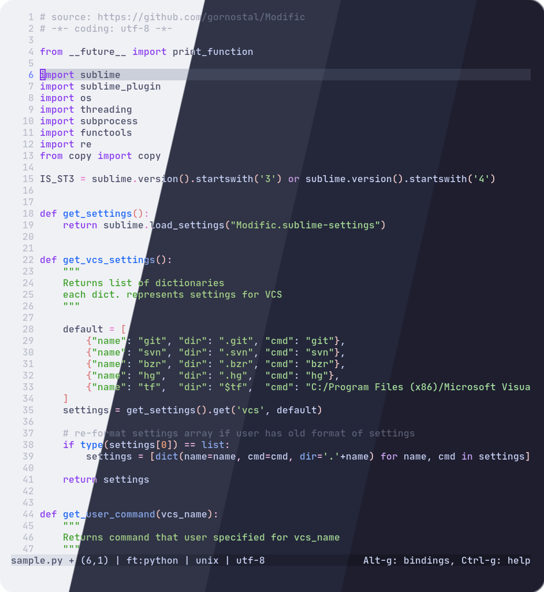
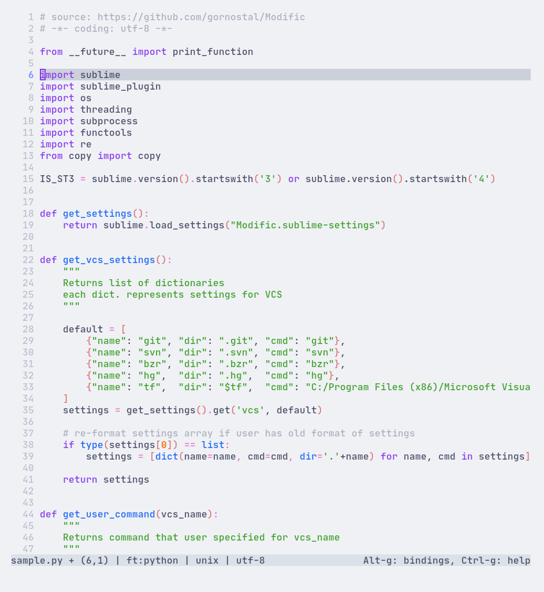
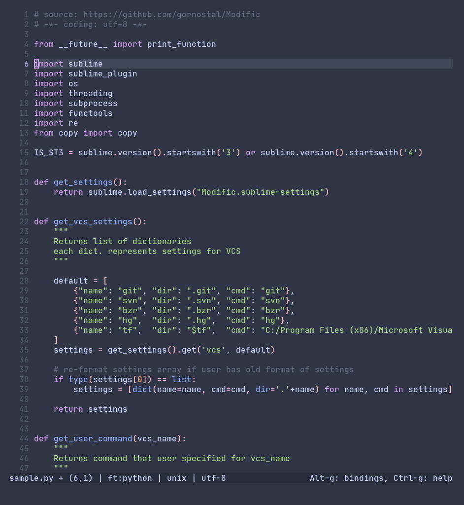
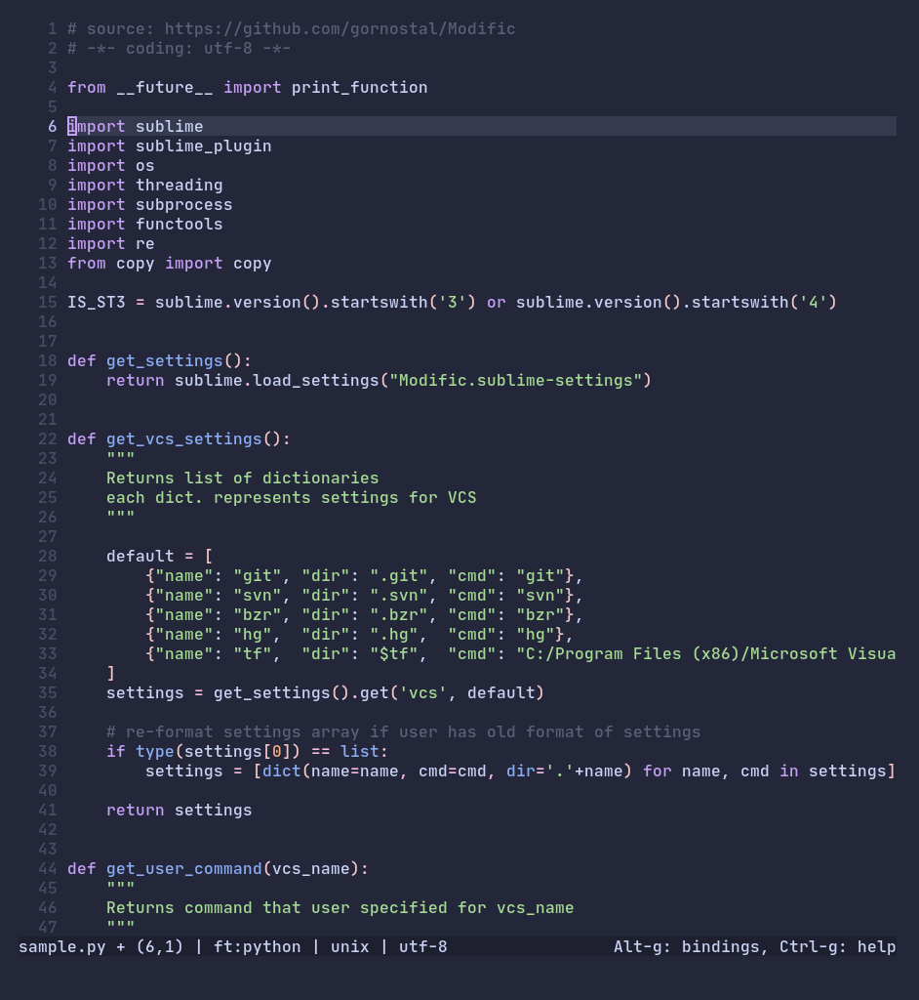
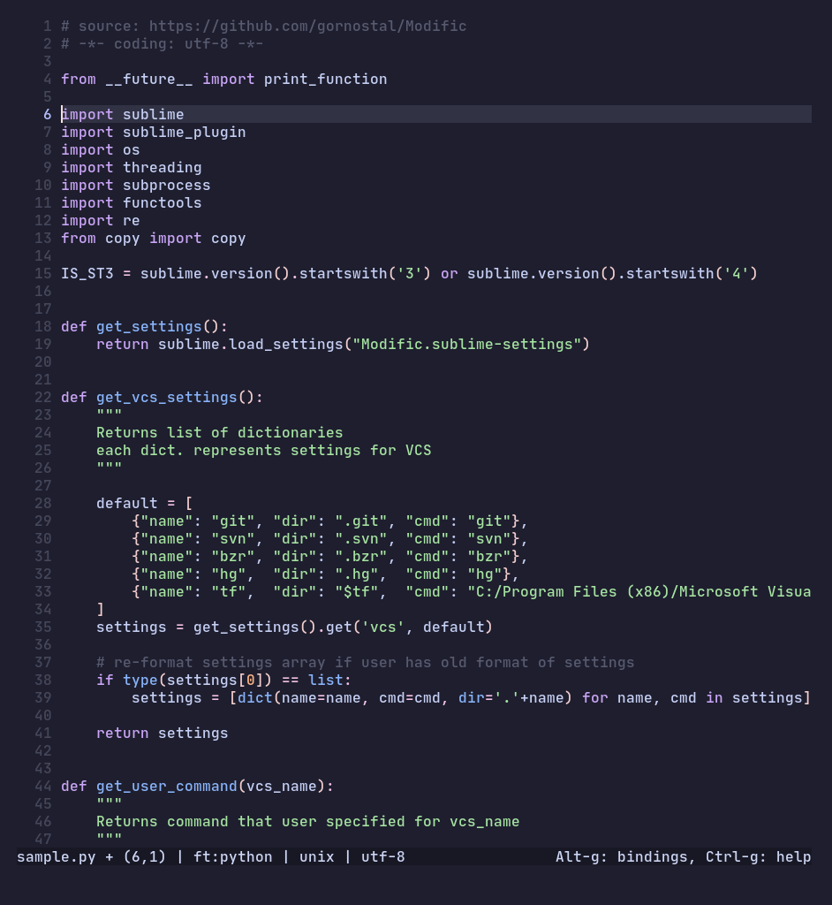

<h3 align="center">
	 
	
	Catppuccin for <a href="https://micro-editor.github.io">micro</a>
	
</h3>

    
    
    

  

## Previews

🌻 Latte

  

🪴 Frappé

  

🌺 Macchiato

  

🌿 Mocha

  

## Usage

1. Copy your preferred flavor(s) from [`src/`](./src/) to `~/.config/micro/colorschemes`.
2. Add `export "MICRO_TRUECOLOR=1"` to your shell RC file (bashrc, zshrc, config.fish, etc).
3. Open Micro, press <kbd>Ctrl</kbd>+<kbd>e</kbd>, type `set colorscheme catppuccin-<flavor>` (where `<flavor>` is one of `latte`, `frappe`, `macchiato`, or `mocha`), and press <kbd>Enter</kbd>.

## 💝 Thanks to

- [elkrien](https://github.com/elkrien)

&nbsp;

Copyright &copy; 2021-present <a href="https://github.com/catppuccin" target="_blank">Catppuccin Org</a>

